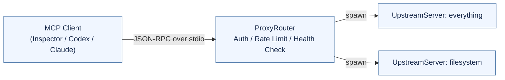
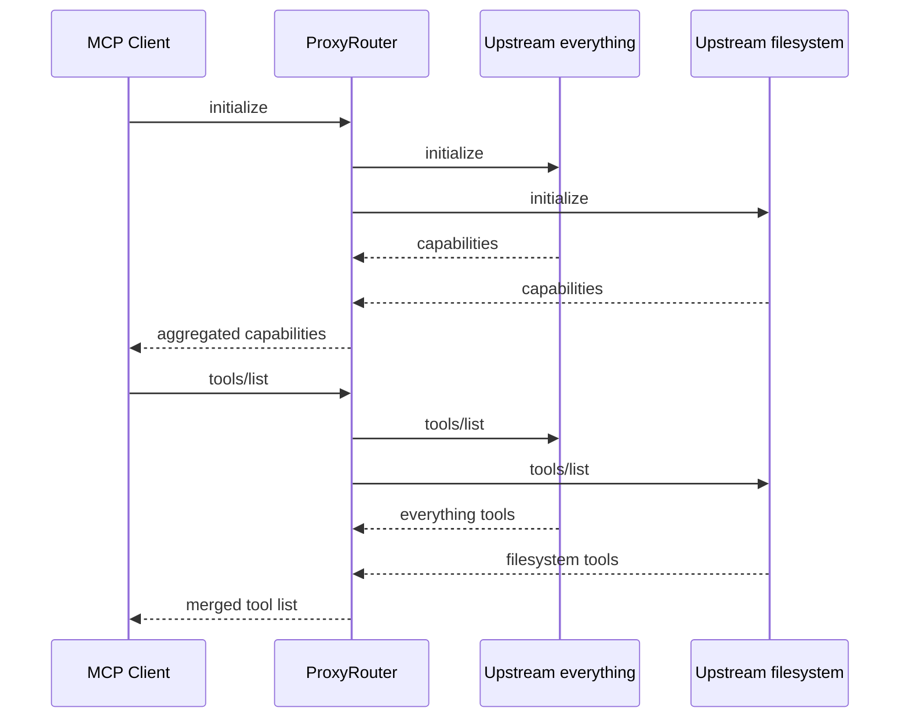

# MCP Proxy — Architecture and Testing Overview

## 1. Background

传统的 MCP Client 只能连接单一下游 Server，在多工具环境下存在以下问题：  
- 无法在同一会话中复用多个 Server 的工具和资源；  
- 当单个 Server 异常或崩溃时，Client 需要手动切换连接；  
- 缺乏集中式的安全、限流、观测和健康检查机制。

为了解决这些痛点，我们设计并实现了一个 **MCP Proxy Server**：  
它对上向客户端暴露单一 MCP 接口，对下同时连接多个 MCP Server，实现多源聚合、命名空间管理、安全与限流等功能，从而提供统一的上下文管理能力。

## 2. System Architecture

### 2.1 Topology

- `ProxyRouter` 作为入口，将客户端的 `initialize`、`tools/*`、`resources/*`、`prompts/*`、`logging/*` 等请求分派到多个 `UpstreamServer` 并聚合结果。
- 每个 `UpstreamServer` 以独立子进程形式运行，负责启动、初始化、请求映射、stderr 泵以及健康检查/自动重启。
- `JsonRpcStream` (framing.py) 处理 Content-Length 与换行 JSON 两种 framing，确保兼容不同实现；安全模块 (security/) 负责鉴权与限流。

### 2.2 Message Flow

客户端通过 MCP 标准 JSON-RPC 协议与 Proxy 交互；Proxy 负责请求的分发、结果的聚合和命名空间管理，从而让客户端看到统一的 “虚拟 MCP Server”。

## 3. Core Components
| 模块                                                  | 职责与特性                                                                                            |
| --------------------------------------------------- | ------------------------------------------------------------------------------------------------ |
| **ProxyRouter (`mcp_proxy/proxy.py`)**              | 处理客户端请求 (`initialize`、`tools/*`、`resources/*` 等)，聚合多下游 Server 的响应，增加命名空间与分页游标。维护请求 ID 映射并处理双向通知。 |
| **UpstreamServer (`mcp_proxy/upstream.py`)**        | 管理下游 Server 的生命周期：启动、初始化、日志管道、健康检查与自动重启。支持多协议 framing。                                           |
| **JsonRpcStream (`mcp_proxy/framing.py`)**          | 统一解析和封装 JSON-RPC 数据帧，兼容 `Content-Length` 与 `newline` 两种 framing 格式。                              |
| **Security 模块 (`mcp_proxy/security/`)**             | 实现 `AuthManager` 与 `RateLimiter`，提供可插拔的鉴权与速率限制机制。                                                |
| **Logging 工具 (`mcp_proxy/utils/logging_utils.py`)** | 提供结构化日志格式化器，统一输出 JSON 格式日志以便收集与监控。                                                               |

### 3.1 ProxyRouter (`mcp_proxy/proxy.py`)
- `ProxyRouter.serve()` 是主循环，持续从 `JsonRpcStream` 读取客户端消息并交给 `_handle_client_message()` 分派，后者根据方法名调用对应的 handler。
- 工具/资源/提示相关的 handler（如 `_handle_tools_list()`、`_handle_resources_list()`、`_handle_prompts_get()`）会向所有 `UpstreamServer` 并发发起请求，随后调用 `_wrap_*` 系列函数改写名称或 URI 并写入 `tool_registry` / `resource_registry` / `prompt_registry`，保证客户端看到的命名空间唯一。
- `_handle_tools_call()`、`_handle_resources_read()` 等基于 registry 将客户端的代理名称还原成下游名称，再把请求透传给指定的 `UpstreamServer`。
- `_ensure_authorized()` 将鉴权和限流整合到入口：解析 `params.proxy.authToken`，调用 `AuthManager` 与 `RateLimiter` 并在拒绝时即时返回 JSON-RPC error。
- `_apply_cursor()` / `_encode_cursor()` 实现跨 server 聚合的分页游标，避免客户端重复数据。

### 3.2 UpstreamServer (`mcp_proxy/upstream.py`)
- `ensure_started()` 依据 `ServerConfig.command` 启动子进程并以 `JsonRpcStream` 绑定 stdio，随后起两个后台任务 `_listen_loop()` 与 `_pump_stderr()` 分别处理响应与日志。
- `initialize()` 将客户端 `initialize` 参数包装后发送给下游，缓存返回的 capabilities，并触发 `notifications/initialized`，供 `ProxyRouter` 聚合。
- `request()`/`notify()` 管理自增的请求 ID 与 `self._pending` future 映射，自动超时与异常转换为 `JsonRpcError`。
- 健康检查通过 `_health_loop()` 定期发送 `ping`，失败时 `_handle_unhealthy()` 触发重启（含指数退避），保障进程异常后自动恢复。
- `shutdown()` 在代理退出或重启前善后，先尝试 `shutdown` 请求，再通过 `terminate()/kill()` 保证子进程完全退出。

### 3.3 JsonRpcStream (`mcp_proxy/framing.py`)
- `read_message()` 同时兼容 Content-Length 与 newline 两种 framing；遇到 JSON 起始符时自动切换到 newline 模式。
- `send_message()` 根据当前协议模式决定写入 `Content-Length` 头或换行结尾，所有写入通过 `asyncio.Lock` 串行化，保证多协程并发写时不会交叉。
- `_read_headers()` 严格解析 header 区，遇到非法行会记录 warning 并忽略，防止单个 server 的噪声污染代理。

### 3.4 配置模块 (`mcp_proxy/config.py`)
- `load_config()` 读取 JSON，校验每个 server 的 `id/command` 与 `stdio_mode`，将其转换成 `ServerConfig` dataclass，缺失字段自动填默认值。
- 顶层 `ProxyConfig` 提供日志级别、超时、鉴权 token、限流、结构化日志和健康检查等开关；这些设置在 `main.run_proxy()` 中一次性生效。

### 3.5 安全组件 (`mcp_proxy/security/`)
- `AuthManager` (`auth.py`) 是最简化的 token 校验器：`is_configured()` 用于检测是否启用，`validate()` 比较请求内 token 与配置是否一致。
- `RateLimiter` (`ratelimit.py`) 基于每分钟速率的 token bucket 算法，`allow(key)` 会按键（token 或 anonymous）回收 token 并决定是否放行。
- 这两个组件由 `ProxyRouter` 注入，未来可按 README 中的 Roadmap 替换为外部服务或多租户策略。

### 3.6 CLI 与入口 (`mcp_proxy/main.py`, `mcp_proxy/__init__.py`)
- `run_proxy()` 负责加载配置、设置日志格式，再通过 `_stdio_streams()` 将同步 STDIN/STDOUT 封装成 `asyncio` reader/writer，并用它构造 `JsonRpcStream`。
- `main()` 构建命令行参数解析器（当前只需要 `--config`），随后 `asyncio.run()` 启动代理；`mcp_proxy/__init__.py` 暴露 `run_proxy` 以便程序化调用或测试。

### 3.7 支撑工具 (`mcp_proxy/jsonrpc.py`, `mcp_proxy/utils/logging_utils.py`)
- `jsonrpc.py` 定义了 `JsonRpcError` 异常以及 `is_request()/is_response()/is_notification()` 助手，确保 Proxy 和 Upstream 对 JSON-RPC 报文的判断统一。
- `JsonFormatter` 将日志标准化为结构化 JSON，附带 UTC 时间戳、级别与额外字段，方便集中采集。

## 4. Protocol Compatibility and Design Principles
| 需求          | 实现说明                                                                                                          |
| ----------- | ------------------------------------------------------------------------------------------------------------- |
| **协议理解**    | 实现了 MCP 协议的 `initialize`、`tools/resources/prompts/logging` 及下游主动请求/通知机制，已通过 Inspector 与 Everything Server 互测。 |
| **代理模块设计**  | ProxyRouter 位于 Client 与多个 UpstreamServer 之间，实现命名空间编码、分页游标和请求映射。                                               |
| **协议兼容性**   | 完全支持 STDIO framing (Content-Length / Newline)，已通过 Inspector、Everything Server、Codex 兼容性测试。                    |
| **安全与可扩展性** | 支持鉴权、限流与健康检查，所有安全模块均为可插拔式设计。                                                                                  |
| **代码规范**    | 模块化结构（config / framing / proxy / upstream / security / utils），带 docstring 与单元测试 `tests/run_proxy_test.py`。    |

## 5. Design Highlights
- 命名空间策略
    - 工具与提示命名采用 serverId__name 格式；
    - 资源 URI 统一为 proxy://resource/<base64>，并保留原始 metadata，确保客户端唯一定位。
- 分页游标
    -  通过 base64-encoded offset 实现跨 Server 聚合分页，所有 list API 共享统一的游标逻辑。

- 错误与超时处理
    - 统一使用 response_timeout、startup_timeout、shutdown_grace 参数防止卡死；
    - 若心跳检测失败，则自动重启 Server 并带指数退避。

- 安全模块
    - ProxyRouter 在请求入口执行统一鉴权与限流检查；
    - 模块以插件形式可替换为更复杂策略（如 token-scoped 或 tenant-level ACL）。                            

## 6. Future Work & Improvements
| 分类          | 改进方向                                        |
| ----------- | ------------------------------------------- |
| **通知路由**    | 目前客户端通知默认广播至所有下游，后续将支持基于配置的精细化路由。           |
| **动态注册**    | 当前 Proxy 使用静态 JSON 配置，未来计划支持运行时动态增删 Server。 |
| **细粒度权限**   | 从共享 token 扩展到命名空间级 / 工具级访问控制。               |
| **控制面 API** | 引入 API 管理下游注册与状态监控，增强可观测性。                  |
| **性能优化**    | 增加缓存与指标采集模块，支持更高并发与 Server 异常容忍。            |

## 7. Testing Summary
详见 `docs/testing_reports.md`，主要包括：

- Inspector + Everything Server
    - 使用官方 Inspector CLI 连接 Proxy，验证 tools/resources/prompts 全链路聚合正确。
    - 验证不同 framing 模式（Content-Length / Newline）下的兼容性。

- Codex MCP Integration
    - 通过 codex mcp add 注册 Proxy。
    - 验证 Codex 能正确列出命名为 everything__* 的工具集。
    - 修复路径冲突与 PYTHONPATH 兼容问题。

## 8. Summary
本设计实现了一个符合 MCP 协议规范、可扩展、可观测的聚合代理层，为 LLM 客户端提供统一的多 Server 接入点。Proxy 在架构上可插拔、模块划分清晰，并支持未来动态扩展与安全增强。
