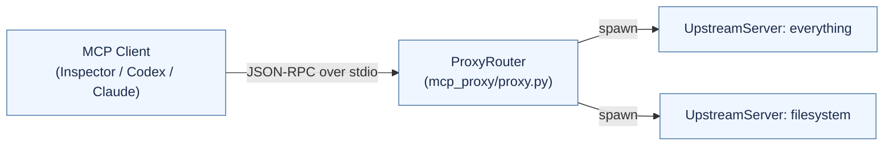

# Architecture & Testing Overview

## 1. Proxy Architecture




- `ProxyRouter` 作为入口，将客户端的所有请求分派到多个 `UpstreamServer` 并汇总结果。
- `UpstreamServer` 负责管理子进程、发送初始化、请求转发、以及监听下游主动请求/通知。
- `JsonRpcStream` (framing.py) 处理 Content-Length 与换行 JSON 两种 framing，确保与不同 server 互通。

## 2. How Requirements Are Met

| Requirement | Implementation Details |
| --- | --- |
| **1. 协议理解** | 代码覆盖 MCP Spec 中的初始化、tools/resources/prompts/logging 等所有核心方法；Inspector/Everything 端到端验证通过。 |
| **2. 代理模块设计** | `ProxyRouter` 插在客户端与多个 `UpstreamServer` 之间，实现工具/提示命名空间、资源 URI 编码、请求路由与聚合。 |
| **3. 协议兼容** | 通过官方 `@modelcontextprotocol/inspector` 客户端和 `server-everything` 进行互测；Codex 兼容性问题（冒号命名、PYTHONPATH）也已修复。 |
| **4. 代码规范** | `mcp_proxy` 模块化拆分为 config/framing/proxy/upstream，核心类和方法都有 docstring，配有单元测试 `tests/run_proxy_test.py`。 |

## 3. Core Components

- **`ProxyRouter` (mcp_proxy/proxy.py)**
  - 聚合工具/提示/资源，并在对外时添加 `serverId__name` 前缀。
  - 维护请求 id 映射，确保 upstream 主动请求也能正确往返。
  - 处理 `resources`, `prompts`, `logging` 等所有 MCP 能力，同时在初始化阶段等待全部 upstream 就绪。

- **`UpstreamServer` (mcp_proxy/upstream.py)**
  - 封装下游 server 的子进程管理，负责初始化、请求/通知发送以及 stderr 日志转发。
  - 自动识别 newline / Content-Length framing，通过 `JsonRpcStream` 提供统一 API。

- **`AuthManager` & `RateLimiter`**
  - 在 `ProxyRouter` 内提供 pluggable 的鉴权与速率控制，默认支持共享 token + 简单令牌桶。
  - 设计成可替换的模块，方便未来接入更复杂的认证或分布式限流方案。

- **`JsonRpcStream` (mcp_proxy/framing.py)**
  - 负责 frame 解析与锁定写入，支持 Inspector、Codex 所使用的不同传输格式。

- **`main.py`**
  - 命令行入口，启动 async loop 并将 stdin/stdout 接入 `ProxyRouter`。

## 4. Testing Summary

详见 `docs/testing_reports.md`，包含：

1. **Inspector + Everything**：使用官方 Inspector CLI 调用 proxy，验证 tools/resources/prompts 全链路。
2. **Codex MCP Integration**：通过 `codex mcp add` 注册 proxy，并确认 Codex 端列出了所有 `everything__*` 工具，解决命名和 PYTHONPATH 问题。

```
